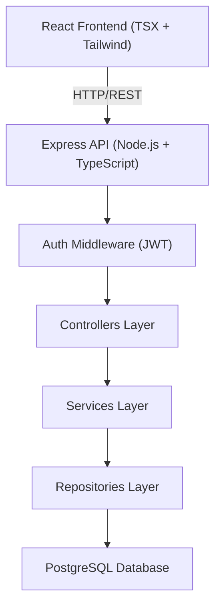
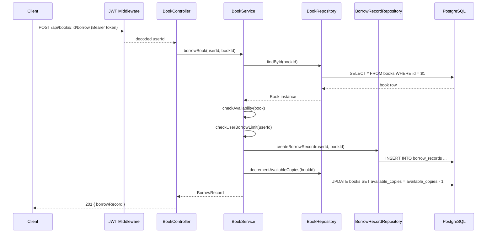
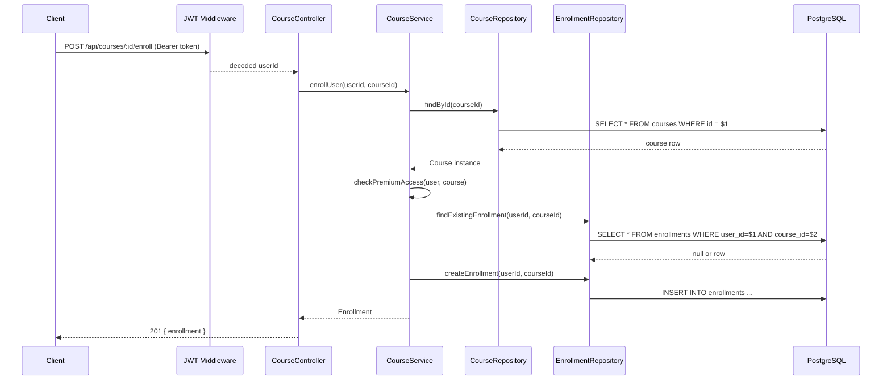
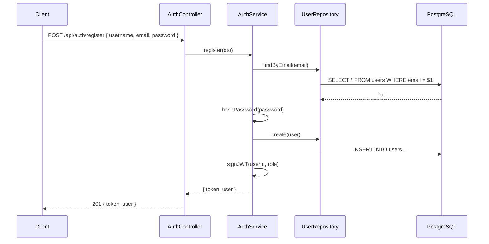

# Design Document: Digital Library and Course Management System

## Overview

A full-stack platform that allows users to browse, borrow books, and enroll in courses with role-based access control (free vs. premium). The backend is built with TypeScript/Node.js/Express using a clean layered architecture (controllers → services → repositories), backed by PostgreSQL, with JWT authentication. The frontend is React (TSX) + Tailwind CSS.

The system enforces availability constraints on book borrowing, tracks course enrollment progress, and gates premium content behind role checks. OOP inheritance models the resource hierarchy: a base `Resource` class is extended by `Book` and `Course`.

## Architecture



### Layer Responsibilities

- controllers — parse HTTP requests, validate input, delegate to services, return responses
- services — enforce business rules (availability, access control, enrollment logic)
- repositories — execute parameterized SQL queries, map rows to domain models
- models — OOP class hierarchy (Resource → Book / Course)
- routes — bind HTTP verbs + paths to controller methods
- config — database pool setup, environment config

## Sequence Diagrams

### Borrow Book Flow



### Course Enrollment Flow



### Auth Flow



## Components and Interfaces

### AuthController

**Purpose**: Handle register and login HTTP requests.

**Interface**:
```typescript
interface IAuthController {
  register(req: Request, res: Response): Promise<void>
  login(req: Request, res: Response): Promise<void>
}
```

**Responsibilities**:
- Validate request body (email, password, username)
- Delegate to AuthService
- Return JWT token and user payload

### BookController

**Purpose**: Handle book search, detail retrieval, borrow, and return requests.

**Interface**:
```typescript
interface IBookController {
  search(req: Request, res: Response): Promise<void>
  getById(req: Request, res: Response): Promise<void>
  borrow(req: Request, res: Response): Promise<void>
  returnBook(req: Request, res: Response): Promise<void>
}
```

### CourseController

**Purpose**: Handle course search, detail retrieval, enrollment, and progress update requests.

**Interface**:
```typescript
interface ICourseController {
  search(req: Request, res: Response): Promise<void>
  getById(req: Request, res: Response): Promise<void>
  enroll(req: Request, res: Response): Promise<void>
  updateProgress(req: Request, res: Response): Promise<void>
}
```

### AuthService

**Purpose**: Business logic for user registration, login, and token issuance.

**Interface**:
```typescript
interface IAuthService {
  register(dto: RegisterDTO): Promise<AuthResult>
  login(dto: LoginDTO): Promise<AuthResult>
}
```

### BookService

**Purpose**: Enforce borrowing rules, availability checks, and borrow limit constraints.

**Interface**:
```typescript
interface IBookService {
  search(query: string, filters: SearchFilters): Promise<Book[]>
  findById(id: string): Promise<Book>
  borrowBook(userId: string, bookId: string): Promise<BorrowRecord>
  returnBook(userId: string, bookId: string): Promise<BorrowRecord>
}
```

### CourseService

**Purpose**: Enforce enrollment rules, premium access checks, and progress tracking.

**Interface**:
```typescript
interface ICourseService {
  search(query: string, filters: SearchFilters): Promise<Course[]>
  findById(id: string): Promise<Course>
  enrollUser(userId: string, courseId: string): Promise<Enrollment>
  updateProgress(userId: string, courseId: string, progress: number): Promise<Enrollment>
}
```

### Repositories

```typescript
interface IUserRepository {
  findById(id: string): Promise<User | null>
  findByEmail(email: string): Promise<User | null>
  create(data: CreateUserDTO): Promise<User>
}

interface IBookRepository {
  findById(id: string): Promise<Book | null>
  search(query: string, filters: SearchFilters): Promise<Book[]>
  decrementAvailableCopies(bookId: string): Promise<void>
  incrementAvailableCopies(bookId: string): Promise<void>
}

interface ICourseRepository {
  findById(id: string): Promise<Course | null>
  search(query: string, filters: SearchFilters): Promise<Course[]>
}

interface IBorrowRecordRepository {
  create(userId: string, bookId: string): Promise<BorrowRecord>
  findActive(userId: string, bookId: string): Promise<BorrowRecord | null>
  findActiveByUser(userId: string): Promise<BorrowRecord[]>
  markReturned(recordId: string): Promise<BorrowRecord>
}

interface IEnrollmentRepository {
  create(userId: string, courseId: string): Promise<Enrollment>
  findByUserAndCourse(userId: string, courseId: string): Promise<Enrollment | null>
  updateProgress(enrollmentId: string, progress: number): Promise<Enrollment>
}
```

## Data Models

### OOP Class Hierarchy

```typescript
abstract class Resource {
  id: string
  title: string
  description: string
  type: 'book' | 'course'
  isPremium: boolean
  createdAt: Date
  updatedAt: Date

  abstract getDisplayInfo(): ResourceDisplayInfo
}

class Book extends Resource {
  author: string
  isbn: string
  availableCopies: number
  totalCopies: number

  getDisplayInfo(): ResourceDisplayInfo
  isAvailable(): boolean  // availableCopies > 0
}

class Course extends Resource {
  instructor: string
  durationHours: number
  modules: CourseModule[]

  getDisplayInfo(): ResourceDisplayInfo
  getTotalModules(): number
}
```

### Supporting Types

```typescript
type UserRole = 'free' | 'premium' | 'admin'

interface User {
  id: string
  username: string
  email: string
  passwordHash: string
  role: UserRole
  createdAt: Date
}

interface BorrowRecord {
  id: string
  userId: string
  bookId: string
  borrowedAt: Date
  dueDate: Date
  returnedAt: Date | null
  status: 'active' | 'returned' | 'overdue'
}

interface Enrollment {
  id: string
  userId: string
  courseId: string
  enrolledAt: Date
  progressPercent: number  // 0–100
  completedAt: Date | null
  status: 'active' | 'completed' | 'dropped'
}

interface CourseModule {
  id: string
  title: string
  order: number
  durationMinutes: number
}

interface SearchFilters {
  isPremium?: boolean
  type?: 'book' | 'course'
  limit?: number
  offset?: number
}

interface AuthResult {
  token: string
  user: Omit<User, 'passwordHash'>
}
```

### Database Schema

```sql
-- users
CREATE TABLE users (
  id UUID PRIMARY KEY DEFAULT gen_random_uuid(),
  username VARCHAR(100) NOT NULL UNIQUE,
  email VARCHAR(255) NOT NULL UNIQUE,
  password_hash TEXT NOT NULL,
  role VARCHAR(20) NOT NULL DEFAULT 'free',
  created_at TIMESTAMPTZ DEFAULT NOW()
);

-- resources (base table for joined inheritance)
CREATE TABLE resources (
  id UUID PRIMARY KEY DEFAULT gen_random_uuid(),
  title VARCHAR(255) NOT NULL,
  description TEXT,
  type VARCHAR(20) NOT NULL CHECK (type IN ('book', 'course')),
  is_premium BOOLEAN NOT NULL DEFAULT false,
  created_at TIMESTAMPTZ DEFAULT NOW(),
  updated_at TIMESTAMPTZ DEFAULT NOW()
);

-- books
CREATE TABLE books (
  id UUID PRIMARY KEY REFERENCES resources(id) ON DELETE CASCADE,
  author VARCHAR(255) NOT NULL,
  isbn VARCHAR(20) UNIQUE,
  available_copies INT NOT NULL DEFAULT 1,
  total_copies INT NOT NULL DEFAULT 1
);

-- courses
CREATE TABLE courses (
  id UUID PRIMARY KEY REFERENCES resources(id) ON DELETE CASCADE,
  instructor VARCHAR(255) NOT NULL,
  duration_hours INT NOT NULL,
  modules JSONB NOT NULL DEFAULT '[]'
);

-- borrow_records
CREATE TABLE borrow_records (
  id UUID PRIMARY KEY DEFAULT gen_random_uuid(),
  user_id UUID NOT NULL REFERENCES users(id),
  book_id UUID NOT NULL REFERENCES books(id),
  borrowed_at TIMESTAMPTZ DEFAULT NOW(),
  due_date TIMESTAMPTZ NOT NULL,
  returned_at TIMESTAMPTZ,
  status VARCHAR(20) NOT NULL DEFAULT 'active'
);

-- enrollments
CREATE TABLE enrollments (
  id UUID PRIMARY KEY DEFAULT gen_random_uuid(),
  user_id UUID NOT NULL REFERENCES users(id),
  course_id UUID NOT NULL REFERENCES courses(id),
  enrolled_at TIMESTAMPTZ DEFAULT NOW(),
  progress_percent INT NOT NULL DEFAULT 0 CHECK (progress_percent BETWEEN 0 AND 100),
  completed_at TIMESTAMPTZ,
  status VARCHAR(20) NOT NULL DEFAULT 'active',
  UNIQUE(user_id, course_id)
);
```

## Algorithmic Pseudocode

### Borrow Book Algorithm

```typescript
async function borrowBook(userId: string, bookId: string): Promise<BorrowRecord>
```

**Preconditions:**
- `userId` references an existing, authenticated user
- `bookId` references an existing book in the database
- User's JWT is valid and not expired

**Postconditions:**
- A new `BorrowRecord` with `status = 'active'` is persisted
- `books.available_copies` is decremented by 1
- Returns the created `BorrowRecord`
- If any check fails, no DB state is mutated (transactional)

**Loop Invariants:** N/A (no loops in this algorithm)

```pascal
ALGORITHM borrowBook(userId, bookId)
INPUT: userId: UUID, bookId: UUID
OUTPUT: BorrowRecord

BEGIN
  // 1. Fetch book — throws NotFoundError if missing
  book ← bookRepository.findById(bookId)
  IF book = null THEN
    THROW NotFoundError("Book not found")
  END IF

  // 2. Premium access check
  user ← userRepository.findById(userId)
  IF book.isPremium AND user.role = 'free' THEN
    THROW ForbiddenError("Premium subscription required")
  END IF

  // 3. Availability check
  IF book.availableCopies <= 0 THEN
    THROW ConflictError("No copies available")
  END IF

  // 4. Concurrent borrow limit (max 3 active borrows per user)
  activeBorrows ← borrowRecordRepository.findActiveByUser(userId)
  IF LENGTH(activeBorrows) >= 3 THEN
    THROW ConflictError("Borrow limit reached (max 3)")
  END IF

  // 5. Duplicate borrow check
  existing ← borrowRecordRepository.findActive(userId, bookId)
  IF existing ≠ null THEN
    THROW ConflictError("Already borrowed this book")
  END IF

  // 6. Persist within a transaction
  BEGIN TRANSACTION
    record ← borrowRecordRepository.create(userId, bookId)
    bookRepository.decrementAvailableCopies(bookId)
  COMMIT TRANSACTION

  RETURN record
END
```

### Return Book Algorithm

```typescript
async function returnBook(userId: string, bookId: string): Promise<BorrowRecord>
```

**Preconditions:**
- An active `BorrowRecord` exists for `(userId, bookId)`

**Postconditions:**
- `BorrowRecord.status` is set to `'returned'`, `returnedAt` is set to NOW()
- `books.available_copies` is incremented by 1

```pascal
ALGORITHM returnBook(userId, bookId)
INPUT: userId: UUID, bookId: UUID
OUTPUT: BorrowRecord

BEGIN
  record ← borrowRecordRepository.findActive(userId, bookId)
  IF record = null THEN
    THROW NotFoundError("No active borrow record found")
  END IF

  BEGIN TRANSACTION
    updated ← borrowRecordRepository.markReturned(record.id)
    bookRepository.incrementAvailableCopies(bookId)
  COMMIT TRANSACTION

  RETURN updated
END
```

### Course Enrollment Algorithm

```typescript
async function enrollUser(userId: string, courseId: string): Promise<Enrollment>
```

**Preconditions:**
- `userId` and `courseId` reference existing records
- User is authenticated

**Postconditions:**
- A new `Enrollment` with `progressPercent = 0`, `status = 'active'` is persisted
- Returns the created `Enrollment`
- If user is already enrolled, throws `ConflictError`

```pascal
ALGORITHM enrollUser(userId, courseId)
INPUT: userId: UUID, courseId: UUID
OUTPUT: Enrollment

BEGIN
  course ← courseRepository.findById(courseId)
  IF course = null THEN
    THROW NotFoundError("Course not found")
  END IF

  user ← userRepository.findById(userId)
  IF course.isPremium AND user.role = 'free' THEN
    THROW ForbiddenError("Premium subscription required")
  END IF

  existing ← enrollmentRepository.findByUserAndCourse(userId, courseId)
  IF existing ≠ null THEN
    THROW ConflictError("Already enrolled in this course")
  END IF

  enrollment ← enrollmentRepository.create(userId, courseId)
  RETURN enrollment
END
```

### Update Course Progress Algorithm

```typescript
async function updateProgress(userId: string, courseId: string, progress: number): Promise<Enrollment>
```

**Preconditions:**
- `progress` is an integer in range [0, 100]
- An active enrollment exists for `(userId, courseId)`

**Postconditions:**
- `Enrollment.progressPercent` is updated to `progress`
- If `progress = 100`, `status` is set to `'completed'` and `completedAt` is set to NOW()

```pascal
ALGORITHM updateProgress(userId, courseId, progress)
INPUT: userId: UUID, courseId: UUID, progress: Integer [0..100]
OUTPUT: Enrollment

BEGIN
  IF progress < 0 OR progress > 100 THEN
    THROW ValidationError("Progress must be between 0 and 100")
  END IF

  enrollment ← enrollmentRepository.findByUserAndCourse(userId, courseId)
  IF enrollment = null THEN
    THROW NotFoundError("Enrollment not found")
  END IF

  IF enrollment.status = 'completed' THEN
    THROW ConflictError("Course already completed")
  END IF

  updated ← enrollmentRepository.updateProgress(enrollment.id, progress)
  RETURN updated
END
```

### JWT Authentication Algorithm

```typescript
async function register(dto: RegisterDTO): Promise<AuthResult>
async function login(dto: LoginDTO): Promise<AuthResult>
```

```pascal
ALGORITHM register(dto)
INPUT: dto { username, email, password }
OUTPUT: AuthResult { token, user }

BEGIN
  existing ← userRepository.findByEmail(dto.email)
  IF existing ≠ null THEN
    THROW ConflictError("Email already registered")
  END IF

  hash ← bcrypt.hash(dto.password, SALT_ROUNDS)
  user ← userRepository.create({ username: dto.username, email: dto.email, passwordHash: hash, role: 'free' })
  token ← jwt.sign({ userId: user.id, role: user.role }, JWT_SECRET, { expiresIn: '7d' })
  RETURN { token, user }
END

ALGORITHM login(dto)
INPUT: dto { email, password }
OUTPUT: AuthResult { token, user }

BEGIN
  user ← userRepository.findByEmail(dto.email)
  IF user = null THEN
    THROW UnauthorizedError("Invalid credentials")
  END IF

  valid ← bcrypt.compare(dto.password, user.passwordHash)
  IF NOT valid THEN
    THROW UnauthorizedError("Invalid credentials")
  END IF

  token ← jwt.sign({ userId: user.id, role: user.role }, JWT_SECRET, { expiresIn: '7d' })
  RETURN { token, user }
END
```

## Key Functions with Formal Specifications

### `BookService.borrowBook`

```typescript
borrowBook(userId: string, bookId: string): Promise<BorrowRecord>
```

**Preconditions:**
- `userId` is a valid UUID of an existing user
- `bookId` is a valid UUID of an existing book
- `book.availableCopies > 0`
- User has fewer than 3 active borrow records
- No active borrow record exists for `(userId, bookId)`
- If `book.isPremium === true`, then `user.role !== 'free'`

**Postconditions:**
- Returns a `BorrowRecord` with `status === 'active'`
- `book.availableCopies` decremented by exactly 1
- Exactly one new row inserted into `borrow_records`
- All mutations are atomic (transaction)

### `CourseService.enrollUser`

```typescript
enrollUser(userId: string, courseId: string): Promise<Enrollment>
```

**Preconditions:**
- `userId` and `courseId` are valid UUIDs of existing records
- No enrollment exists for `(userId, courseId)`
- If `course.isPremium === true`, then `user.role !== 'free'`

**Postconditions:**
- Returns an `Enrollment` with `progressPercent === 0` and `status === 'active'`
- Exactly one new row inserted into `enrollments`

### `CourseService.updateProgress`

```typescript
updateProgress(userId: string, courseId: string, progress: number): Promise<Enrollment>
```

**Preconditions:**
- `progress ∈ [0, 100]` (integer)
- Active enrollment exists for `(userId, courseId)`
- `enrollment.status !== 'completed'`

**Postconditions:**
- `enrollment.progressPercent === progress`
- If `progress === 100`: `enrollment.status === 'completed'` AND `enrollment.completedAt` is set
- No other enrollment fields are mutated

### `AuthService.register`

```typescript
register(dto: RegisterDTO): Promise<AuthResult>
```

**Preconditions:**
- `dto.email` is not already registered
- `dto.password` meets minimum length (≥ 8 characters)
- `dto.username` is non-empty

**Postconditions:**
- New user persisted with `role === 'free'`
- Password stored as bcrypt hash (never plaintext)
- Returns signed JWT valid for 7 days

## Example Usage

```typescript
// Register a new user
const authResult = await authService.register({
  username: 'alice',
  email: 'alice@example.com',
  password: 'securePass123'
})
// authResult.token → JWT string
// authResult.user.role → 'free'

// Search books
const books = await bookService.search('typescript', { isPremium: false })

// Borrow a book
const record = await bookService.borrowBook(authResult.user.id, books[0].id)
// record.status → 'active'
// record.dueDate → NOW + 14 days

// Enroll in a course
const enrollment = await courseService.enrollUser(authResult.user.id, courseId)
// enrollment.progressPercent → 0

// Update progress
const updated = await courseService.updateProgress(authResult.user.id, courseId, 50)
// updated.progressPercent → 50

// Complete course
const completed = await courseService.updateProgress(authResult.user.id, courseId, 100)
// completed.status → 'completed'
// completed.completedAt → Date
```

## Correctness Properties

- ∀ borrow operations: `book.availableCopies` after borrow = `book.availableCopies` before − 1
- ∀ return operations: `book.availableCopies` after return = `book.availableCopies` before + 1
- ∀ users: `COUNT(active borrow records) ≤ 3` at any point in time
- ∀ `(userId, bookId)` pairs: at most one active `BorrowRecord` exists
- ∀ `(userId, courseId)` pairs: at most one `Enrollment` row exists (enforced by UNIQUE constraint)
- ∀ enrollments: `progressPercent ∈ [0, 100]` (enforced by DB CHECK constraint)
- ∀ premium resources: only users with `role ∈ { 'premium', 'admin' }` can borrow/enroll
- ∀ JWT tokens: `userId` and `role` claims are always present and match the user record
- ∀ passwords: stored exclusively as bcrypt hashes, never in plaintext

## Error Handling

### NotFoundError (404)

**Condition**: Requested resource (book, course, user, borrow record, enrollment) does not exist.
**Response**: `{ error: "Resource not found", code: "NOT_FOUND" }`
**Recovery**: Client should verify the ID and retry with a valid resource.

### ForbiddenError (403)

**Condition**: Free-tier user attempts to access a premium resource.
**Response**: `{ error: "Premium subscription required", code: "FORBIDDEN" }`
**Recovery**: User upgrades to premium role.

### ConflictError (409)

**Condition**: Duplicate borrow, duplicate enrollment, borrow limit exceeded, or no copies available.
**Response**: `{ error: "<specific message>", code: "CONFLICT" }`
**Recovery**: Client checks current state before retrying.

### UnauthorizedError (401)

**Condition**: Missing, expired, or invalid JWT token; invalid login credentials.
**Response**: `{ error: "Unauthorized", code: "UNAUTHORIZED" }`
**Recovery**: Client re-authenticates and obtains a fresh token.

### ValidationError (400)

**Condition**: Request body fails schema validation (missing fields, invalid types, out-of-range values).
**Response**: `{ error: "<field> is invalid", code: "VALIDATION_ERROR" }`
**Recovery**: Client corrects the request payload.

## Testing Strategy

### Unit Testing Approach

Test each service method in isolation by mocking all repository dependencies. Key cases:
- `borrowBook`: available book, unavailable book, premium book + free user, borrow limit reached, duplicate borrow
- `enrollUser`: new enrollment, duplicate enrollment, premium course + free user
- `updateProgress`: valid range, out-of-range value, completion at 100%, already-completed enrollment
- `register`: new email, duplicate email, password hashing
- `login`: valid credentials, wrong password, unknown email

### Property-Based Testing Approach

**Property Test Library**: fast-check

Key properties to verify:
- Borrowing and returning a book always restores `availableCopies` to its original value
- `progressPercent` is always in [0, 100] regardless of input
- A user can never have more than 3 simultaneous active borrows
- Registering with the same email twice always yields a conflict error
- JWT tokens decoded always contain `userId` and `role` matching the registered user

### Integration Testing Approach

Test the full request → controller → service → repository → DB pipeline using a test PostgreSQL instance:
- Auth endpoints: register, login, token validation
- Book endpoints: search, borrow, return (with real DB state changes)
- Course endpoints: search, enroll, progress update
- Middleware: JWT guard rejects requests without valid tokens

## Performance Considerations

- Add indexes on `borrow_records(user_id, status)` and `enrollments(user_id, course_id)` for fast lookups
- Use a PostgreSQL connection pool (pg-pool) with a sensible max connection limit
- Search queries on `resources.title` should use a `GIN` index with `pg_trgm` for full-text similarity
- Borrow and return operations use DB transactions to prevent race conditions on `available_copies`

## Security Considerations

- Passwords hashed with bcrypt (minimum 10 salt rounds)
- JWT secret stored in environment variable, never hardcoded
- JWT expiry set to 7 days; consider refresh token strategy for production
- All SQL queries use parameterized statements (no string interpolation) to prevent SQL injection
- Role checks enforced in the service layer, not just the route layer
- `passwordHash` field never included in API responses

## Dependencies

| Package | Purpose |
|---|---|
| express | HTTP server framework |
| pg / pg-pool | PostgreSQL client |
| bcrypt | Password hashing |
| jsonwebtoken | JWT sign/verify |
| zod | Request body validation |
| fast-check | Property-based testing |
| jest / ts-jest | Unit and integration testing |
| react | Frontend UI |
| tailwindcss | Frontend styling |
| axios | Frontend HTTP client |
