# Entity Relationship Diagram - Digital Library & Course Management System

## ER Diagram

```mermaid
erDiagram
    User {
        uuid id PK
        string username UK
        string email UK
        string passwordHash
        enum role
        datetime createdAt
    }

    Resource {
        uuid id PK
        string title
        string description
        enum type
        string category
        json tags
        boolean isPremium
        datetime createdAt
        datetime updatedAt
    }

    Book {
        uuid id PK,FK
        string author
        string isbn UK
        int availableCopies
        int totalCopies
    }

    Course {
        uuid id PK,FK
        string instructor
        int durationHours
        json modules
    }

    BorrowRecord {
        uuid id PK
        uuid userId FK
        uuid bookId FK
        datetime borrowedAt
        datetime dueDate
        datetime returnedAt
        enum status
    }

    Enrollment {
        uuid id PK
        uuid userId FK
        uuid courseId FK
        datetime enrolledAt
        int progressPercent
        datetime completedAt
        enum status
    }

    CourseModuleProgress {
        uuid id PK
        uuid enrollmentId FK
        string moduleId
        int moduleIndex
        string title
        boolean completed
        datetime completedAt
    }

    LearningPath {
        uuid id PK
        string title
        string description
        string slug UK
        enum difficulty
        int estimatedHours
        json tags
        boolean isPremium
        datetime createdAt
        datetime updatedAt
    }

    LearningPathItem {
        uuid id PK
        uuid learningPathId FK
        uuid resourceId FK
        int position
        string notes
    }

    UserLearningPath {
        uuid id PK
        uuid userId FK
        uuid learningPathId FK
        datetime startedAt
        datetime completedAt
        enum status
        int progressPercent
        json completedItemIds
    }

    %% Relationships
    User ||--o{ BorrowRecord : "borrows"
    User ||--o{ Enrollment : "enrolls"
    User ||--o{ UserLearningPath : "follows"

    Resource ||--o| Book : "extends"
    Resource ||--o| Course : "extends"
    Resource ||--o{ LearningPathItem : "included_in"

    Book ||--o{ BorrowRecord : "borrowed_as"
    Course ||--o{ Enrollment : "enrolled_in"

    Enrollment ||--o{ CourseModuleProgress : "tracks"

    LearningPath ||--o{ LearningPathItem : "contains"
    LearningPath ||--o{ UserLearningPath : "followed_by"

    LearningPathItem }o--|| Resource : "references"
    UserLearningPath }o--|| User : "belongs_to"
    UserLearningPath }o--|| LearningPath : "follows"
```

## Entity Descriptions

### Core Entities

#### User
- **Primary Key**: `id` (UUID)
- **Unique Keys**: `username`, `email`
- **Role Types**: FREE, PREMIUM, ADMIN
- **Purpose**: Manages user authentication and authorization

#### Resource (Base Entity)
- **Primary Key**: `id` (UUID)
- **Types**: BOOK, COURSE
- **Purpose**: Abstract base for all learning resources
- **Inheritance**: Extended by Book and Course entities

#### Book (Extends Resource)
- **Primary Key**: `id` (UUID, FK to Resource)
- **Unique Keys**: `isbn`
- **Purpose**: Manages physical/digital book inventory
- **Business Rules**: 
  - Tracks available vs total copies
  - Supports borrowing workflow

#### Course (Extends Resource)
- **Primary Key**: `id` (UUID, FK to Resource)
- **Purpose**: Manages online courses and learning modules
- **Features**: 
  - JSON-based module structure
  - Duration tracking
  - Instructor information

### Transaction Entities

#### BorrowRecord
- **Primary Key**: `id` (UUID)
- **Foreign Keys**: `userId`, `bookId`
- **Status Types**: ACTIVE, RETURNED, OVERDUE
- **Purpose**: Tracks book borrowing lifecycle
- **Business Rules**:
  - Max 3 active borrows per user
  - Due date enforcement
  - Return tracking

#### Enrollment
- **Primary Key**: `id` (UUID)
- **Foreign Keys**: `userId`, `courseId`
- **Unique Constraint**: `(userId, courseId)`
- **Status Types**: ACTIVE, COMPLETED, DROPPED
- **Purpose**: Manages course enrollment and progress
- **Features**:
  - Progress percentage (0-100%)
  - Completion tracking

#### CourseModuleProgress
- **Primary Key**: `id` (UUID)
- **Foreign Keys**: `enrollmentId`
- **Unique Constraint**: `(enrollmentId, moduleId)`
- **Purpose**: Granular tracking of module completion within courses

### Learning Path System

#### LearningPath
- **Primary Key**: `id` (UUID)
- **Unique Keys**: `slug`
- **Difficulty Levels**: BEGINNER, INTERMEDIATE, ADVANCED
- **Purpose**: Curated sequences of learning resources
- **Features**:
  - Estimated completion hours
  - Premium/free access control
  - Tag-based categorization

#### LearningPathItem
- **Primary Key**: `id` (UUID)
- **Foreign Keys**: `learningPathId`, `resourceId`
- **Unique Constraint**: `(learningPathId, position)`
- **Purpose**: Ordered items within learning paths
- **Features**:
  - Position-based ordering
  - Optional notes for guidance

#### UserLearningPath
- **Primary Key**: `id` (UUID)
- **Foreign Keys**: `userId`, `learningPathId`
- **Unique Constraint**: `(userId, learningPathId)`
- **Status Types**: ACTIVE, COMPLETED, ABANDONED
- **Purpose**: Tracks user progress through learning paths
- **Features**:
  - Progress percentage calculation
  - Completed items tracking (JSON array)

## Key Relationships

### One-to-Many Relationships
- User → BorrowRecord (1:N)
- User → Enrollment (1:N)
- User → UserLearningPath (1:N)
- Book → BorrowRecord (1:N)
- Course → Enrollment (1:N)
- Enrollment → CourseModuleProgress (1:N)
- LearningPath → LearningPathItem (1:N)
- LearningPath → UserLearningPath (1:N)
- Resource → LearningPathItem (1:N)

### One-to-One Relationships
- Resource → Book (1:1, inheritance)
- Resource → Course (1:1, inheritance)

### Unique Constraints
- `(userId, courseId)` in Enrollment - prevents duplicate enrollments
- `(userId, learningPathId)` in UserLearningPath - one path instance per user
- `(enrollmentId, moduleId)` in CourseModuleProgress - unique module progress
- `(learningPathId, position)` in LearningPathItem - ordered path items

## Business Rules Enforced

1. **Access Control**: Premium resources restricted by user role
2. **Borrow Limits**: Maximum 3 active book borrows per user
3. **Progress Tracking**: Automatic completion when progress reaches 100%
4. **Inventory Management**: Available copies decremented on borrow
5. **Duplicate Prevention**: Unique constraints prevent duplicate enrollments/borrows
6. **Cascade Deletion**: Related records cleaned up when parent entities are deleted

## Indexes for Performance

- `(type, createdAt)` on Resource - for filtered resource listings
- `(userId, status)` on BorrowRecord - for user's active borrows
- `(courseId, status)` on Enrollment - for course enrollment stats
- `(difficulty, createdAt)` on LearningPath - for difficulty-based browsing