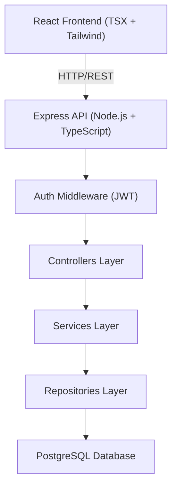
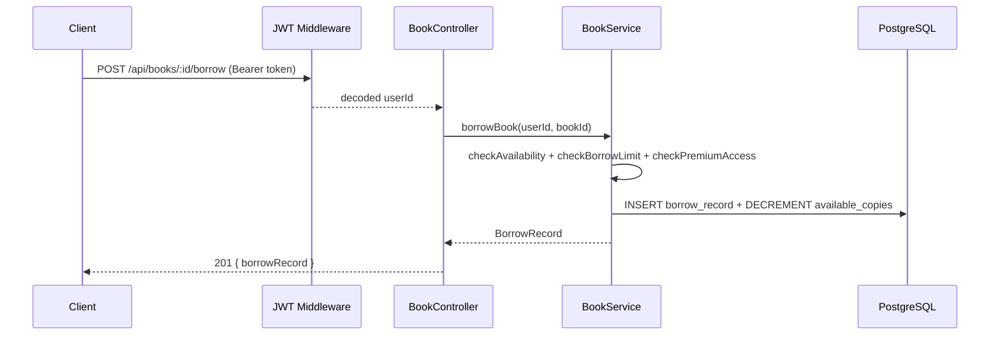
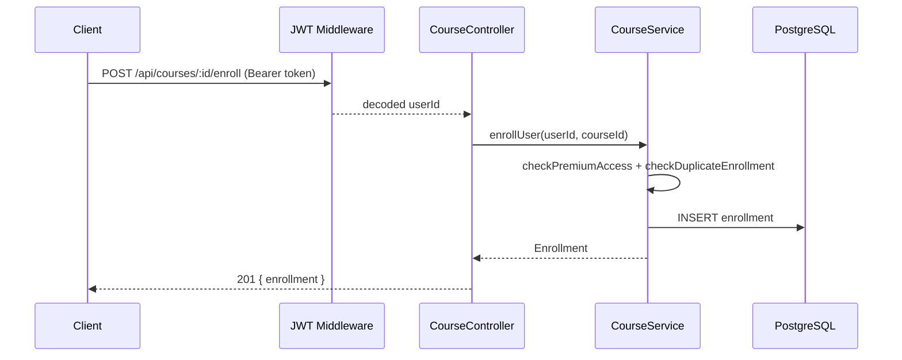

# Digital Library & Course Management System

A full-stack platform that allows users to browse, borrow books, and enroll in courses with role-based access control (free vs. premium). The backend is built with TypeScript/Node.js/Express using a clean layered architecture, backed by PostgreSQL (Neon), with JWT authentication. The frontend is React (TSX) + Tailwind CSS.

## Project Structure

```
SD_Project/
├── backend/        # Node.js + TypeScript + Express + Prisma
└── frontend/       # React (TSX) + Tailwind CSS
```

## Tech Stack

| Layer | Technology |
|---|---|
| Backend | Node.js, TypeScript, Express |
| ORM | Prisma |
| Database | PostgreSQL (Neon) |
| Auth | JWT + bcrypt |
| Frontend | React (TSX), Tailwind CSS |
| Validation | Zod |

## Architecture



### Layer Responsibilities

- controllers — parse HTTP requests, validate input, delegate to services, return responses
- services — enforce business rules (availability, access control, enrollment logic)
- repositories — execute Prisma queries, map rows to domain models
- models — OOP class hierarchy (Resource → Book / Course)
- routes — bind HTTP verbs + paths to controller methods
- config — database pool setup, environment config

## Core Features

- Users can search books & courses
- Users can borrow books (availability check, max 3 concurrent borrows)
- Users can enroll in courses (progress tracking 0–100%)
- Free vs Premium access control
- JWT-based register/login authentication

## Database Schema

```
users
resources (base table)
books       → extends resources
courses     → extends resources
borrow_records
enrollments
```

## OOP Design

```typescript
abstract class Resource {
  id, title, description, type, isPremium, createdAt, updatedAt
  abstract getDisplayInfo(): ResourceDisplayInfo
}

class Book extends Resource {
  author, isbn, availableCopies, totalCopies
  isAvailable(): boolean
}

class Course extends Resource {
  instructor, durationHours, modules
  getTotalModules(): number
}
```

## System Flows

### Borrow Book Flow



### Course Enrollment Flow



## API Endpoints (Planned)

| Method | Endpoint | Description |
|---|---|---|
| POST | /api/auth/register | Register new user |
| POST | /api/auth/login | Login + get JWT |
| GET | /api/books | Search books |
| POST | /api/books/:id/borrow | Borrow a book |
| POST | /api/books/:id/return | Return a book |
| GET | /api/courses | Search courses |
| POST | /api/courses/:id/enroll | Enroll in course |
| PATCH | /api/courses/:id/progress | Update progress |

## Business Rules

- Max 3 active borrows per user at any time
- Premium resources only accessible to premium/admin users
- Duplicate borrow or enrollment not allowed
- Progress percent must be in range [0, 100]
- On progress = 100, enrollment status auto-set to `completed`

## Getting Started

```bash
# Backend
cd backend
npm install
cp .env.example .env   # add your DATABASE_URL and JWT_SECRET
npm run db:generate
npm run dev
```

## Environment Variables

```env
DATABASE_URL=your_neon_postgresql_url
JWT_SECRET=your_jwt_secret
PORT=3000
```
